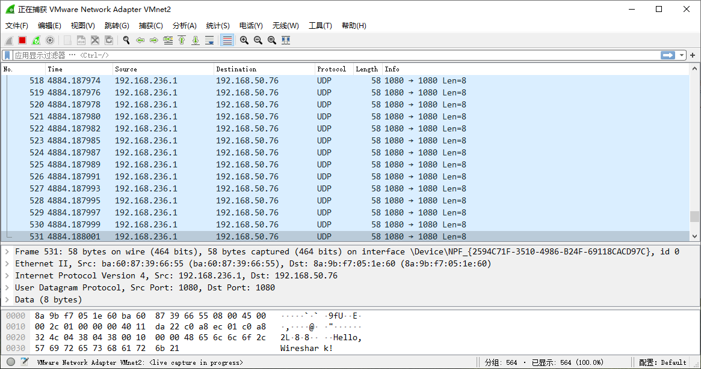

# Distributed_System_Labs
## Lab 1 Reliable Data Transport Protocol

### 设计策略

* **策略选择**

  * 采用Selective Repeat策略。

* **Packet设计**

  * 原则：只增加必要的信息进包头，选择满足条件的占用最少的数据类型。

  * 无条件在头部增加两字节存放校验码，因使用16位校验，选取unsigned int作为数据类型。

  * 尝试后发现测试用例的发包大概在几万这个数量级，因此新增的包的编号选择了unsigned int。

  * packet number在发送方为全局变量，因此保证了message的顺序，不需要添加message的信息。

  * Data Packet

    | Checksum | Packet number | Payload size | Payload  |
    | -------- | ------------- | ------------ | -------- |
    | 2 Bytes  | 2 Bytes       | 1 Byte       | The rest |

  * ACK Packet

    | Checksum | ACK number | Nothing  |
    | -------- | ---------- | -------- |
    | 2 Bytes  | 2 Bytes    | The rest |

### 实现策略

* **Sender**
  * packet number初始化为0，新包取当前packet number作为包号，并增加packet number。
  * 维护三个队列，分别对应包、包号、是否受到ACK，所有新包直接排进队列末尾，但活跃区仅为前WINDOWSIZE个元素。
  * 加入新进队的包处在活跃区，则发出这个包并（重新）开始计时。
  * 收到某个包的ACK时，如果这个包在队列中间，则仅标记其ACK为true；如果这个包在队首，则弹出队首开始连续的已收到ACK的包，然后依次发送新进入活跃区的包，并重新开始计时。**(滑动窗口)**
  * 一旦超时，若队列为空说明包发完了，直接返回；若队列不为空则依次发送活跃区内ACK状态为false的包，并重新开始计时。**(选择重传)**
  * 整个过程没有用到停止计时的功能。
* **Receiver**
  * next number初始化为0，表示当前等待的包的包号，收到该包后递增。
  * 维护两个队列，分别对应包、包号，符合条件的新收到的包会进入队列。
  * 收到包号小于next number的包，说明之前该包的ACK未送达，重发ACK后丢弃该包。
  * 收到包号在next number到next number + BUFFERSIZE - 1之间的包，检查队列内是否存在该包，存在则说明之前该包的ACK未送达，重发ACK后丢弃该包；不存在则放进队首，维护队列，发送ACK。
  * 收到包号超过next number + BUFFERSIZE - 1的包，说明滑窗出现了bug，但说不定还有救，直接丢弃并且不发ACK，万一滑窗又好了它会再次发送该包的。
  * 维护队列仅在新包进入队列时发生，放入新包后整理队列保持升序，若队首包号为next number，则将队首开始连续包号的包依次弹出传递给上层，并修改next number为最后一个弹出的后一位，如果弹空了则表示某一阶段的数据传输完毕。

### 参数选取

| TIMEOUT | BUFFER SIZE |
| ------- | ----------- |
| 0.3     | 16          |

首先用TA推荐的0.3作为超时限制，依次测试以2 ~ 16作为缓冲区大小的结果，得到如下趋势：


可见在超时限制不变的前提下缓冲区越大，吞吐量越高，传输耗时越低。但大容量缓冲区在实际情况下会增加对硬件的要求，因此适可而止地加到16就没再上探了。

然后以16作为缓冲区的大小，又依次测试了0.1 ~ 0.7作为超时限制的结果，得到如下趋势：


可见虽然超时时限越低吞吐量越高，传输耗时越短，但从传输数据与超时时长关系中会发现，过短的超时限制带来的性能提升背后是相同数据被反复重传的巨大开支，而大于0.3的超时限制不会再减少传输数据量，因此选择TA给出的0.3确实是比较合适的超时限制。**(详细测试数据参见test_data.xlsx)**

### 遇到的坑

* 一开始试图给message编号，再给message里的packet单独编号，后来发现这种设计没有必要，而且增加复杂度和开支，具体表现在需要事先告知接收方某条message的包数，而这条信息本身也可能崩掉。
* 因为有队列单独维护ACK状态和next number，在连续弹出的时候用队列的front()作为循环体的判断条件，忽略了队列可能在弹出过程中弹空导致下一次循环判断调用front()时出现无法预估的错误。

## Lab 2 Send and receive packets with DPDK

### Part 0 Set up environment

基础环境：~~Ubuntu 18.04 LTS~~降级DPDK后各种报错又把Ubuntu 16.04 LTS装回来了

安装依赖：

```shell
$ sudo apt install libpcap-dev
```

~~下载DPDK，我选了目前LTS分支的最新版本19\.11，~~根据TA的要求更换为指定版本16\.11\.11，解压后执行：

```shell
 $ make config T=x86_64-native-linuxapp-gcc
 $ sed -ri 's,(PMD_PCAP=).*,\1y,' build/.config
 $ make
```

经过漫长的等待编译完毕，然后配置DPDK的运行环境，以root用户运行：

```shell
$ mkdir -p /mnt/huge
$ mount -t hugetlbfs nodev /mnt/huge
$ echo 64 > /sys/devices/system/node/node0/hugepages/hugepages-2048kB/nr_hugepages
$ modprobe uio
$ insmod ./build/kmod/igb_uio.ko
$ ./tools/dpdk-devbind.py -s
$ ./tools/dpdk-devbind.py --bind=igb_uio 02:00.0
$ export RTE_SDK=/home/richard/Desktop/dpdk
$ export RTE_TARGET=build
```

绑定网卡那一步会报警告可以无视无伤大雅，然后测试一下DPDK是否成功安装：

```shell
$ cd $RTE_SDK/examples/helloworld
$ make
$ ./build/helloworld
```

得到输出：

```shell
...
hello from core 1
hello from core 2
hello from core 3
hello from core 0
```

### Part 1 Get familiar with DPDK

Q1: What’s the purpose of using hugepage?

* 在内存容量不变的条件下，页越大，页表项越少，页表占用的内存越少。更少的页表项意味着缺页的情况更不容易发生，缺页中断的次数会减少，TLB的miss次数也会减少。

Q2: Take examples/helloworld as an example, describe the execution flow of DPDK programs?

* 初始化Environment Abstraction Layer \(EAL\)，在main\(\)函数中：

  ```c++
  ret = rte_eal_init(argc, argv);
  if (ret < 0)
  	rte_panic("Cannot init EAL\n");
  ```

  在Linux环境下该调用在main\(\)被调用前完成初始化流程（每个lcore的初始化等），返回的是参数的个数。

* 在从属核心上调用lcore\_hello\(\)：

  ```c++
  RTE_LCORE_FOREACH_SLAVE(lcore_id) {
  	rte_eal_remote_launch(lcore_hello, NULL, lcore_id);
  }
  ```

* 在主核心上调用lcore\_hello\(\)：

  ```c++
  lcore_hello(NULL);
  ```

* 最后等待所有线程执行结束：

  ```c++
  rte_eal_mp_wait_lcore();
  ```

Q3: Read the codes of examples/skeleton, describe DPDK APIs related to sending and receiving packets\.

* rte\_eth\_tx\_burst\(\)，定义如下：

  ```c++
  static uint16_t rte_eth_tx_burst (
      uint16_t port_id,
      uint16_t queue_id,
      struct rte_mbuf ** tx_pkts,
      uint16_t nb_pkts
  )
  ```

  用于在参数port\_id指定的以太网设备上发送参数queue\_id指定的输出队列上的数据包，参数nb\_pkts指定了要发送的数据包的数量，这些数据包由rte\_mbuf结构的参数tx\_pkts提供，函数返回实际发送的包的数量。

* rte\_eth\_rx\_burst\(\)，定义如下：

  ```c++
  static uint16_t rte_eth_rx_burst (
      uint16_t port_id,
      uint16_t queue_id,
      struct rte_mbuf ** rx_pkts,
      const uint16_t nb_pkts
  )	
  ```

  用于在参数port\_id指定的以太网设备上的由参数queue\_id指定的接收队列上循环解析RX ring，最多nb\_pkts个包，并且对于每一个完整的RX descriptor，初始化一个rte\_mbuf结构的数据，并存放到参数tx\_pkts的下一个目录。

Q4: Describe the data structure of ‘rte\_mbuf’\.

* 在rte\_mbuf\_core\.h的第467行找到其定义如下：

  ```c++
  struct rte_mbuf {
      RTE_MARKER cacheline0;
  
      void *buf_addr;           
      RTE_STD_C11
      union {
          rte_iova_t buf_iova;
          rte_iova_t buf_physaddr; 
      } __rte_aligned(sizeof(rte_iova_t));
  
      /* next 8 bytes are initialised on RX descriptor rearm */
      RTE_MARKER64 rearm_data;
      uint16_t data_off;
  
      RTE_STD_C11
      union {
          rte_atomic16_t refcnt_atomic; 
          uint16_t refcnt;
      };
      uint16_t nb_segs;         
      uint16_t port;
  
      uint64_t ol_flags;        
      /* remaining bytes are set on RX when pulling packet from descriptor */
      RTE_MARKER rx_descriptor_fields1;
  
      /*
       * The packet type, which is the combination of outer/inner L2, L3, L4
       * and tunnel types. The packet_type is about data really present in the
       * mbuf. Example: if vlan stripping is enabled, a received vlan packet
       * would have RTE_PTYPE_L2_ETHER and not RTE_PTYPE_L2_VLAN because the
       * vlan is stripped from the data.
       */
      RTE_STD_C11
      union {
          uint32_t packet_type; 
          struct {
              uint32_t l2_type:4; 
              uint32_t l3_type:4; 
              uint32_t l4_type:4; 
              uint32_t tun_type:4; 
              RTE_STD_C11
              union {
                  uint8_t inner_esp_next_proto;
                  __extension__
                  struct {
                      uint8_t inner_l2_type:4;
                      uint8_t inner_l3_type:4;
                  };
              };
              uint32_t inner_l4_type:4; 
          };
      };
  
      uint32_t pkt_len;         
      uint16_t data_len;        
      uint16_t vlan_tci;
  
      RTE_STD_C11
      union {
          union {
              uint32_t rss;     
              struct {
                  union {
                      struct {
                          uint16_t hash;
                          uint16_t id;
                      };
                      uint32_t lo;
                  };
                  uint32_t hi;
              } fdir; 
              struct rte_mbuf_sched sched;
              struct {
                  uint32_t reserved1;
                  uint16_t reserved2;
                  uint16_t txq;
              } txadapter; 
              uint32_t usr;
          } hash;                   
      };
  
      uint16_t vlan_tci_outer;
  
      uint16_t buf_len;         
      uint64_t timestamp;
  
      /* second cache line - fields only used in slow path or on TX */
      RTE_MARKER cacheline1 __rte_cache_min_aligned;
  
      RTE_STD_C11
      union {
          void *userdata;   
          uint64_t udata64; 
      };
  
      struct rte_mempool *pool; 
      struct rte_mbuf *next;    
      /* fields to support TX offloads */
      RTE_STD_C11
      union {
          uint64_t tx_offload;       
          __extension__
          struct {
              uint64_t l2_len:RTE_MBUF_L2_LEN_BITS;
              uint64_t l3_len:RTE_MBUF_L3_LEN_BITS;
              uint64_t l4_len:RTE_MBUF_L4_LEN_BITS;
              uint64_t tso_segsz:RTE_MBUF_TSO_SEGSZ_BITS;
              /*
               * Fields for Tx offloading of tunnels.
               * These are undefined for packets which don't request
               * any tunnel offloads (outer IP or UDP checksum,
               * tunnel TSO).
               *
               * PMDs should not use these fields unconditionally
               * when calculating offsets.
               *
               * Applications are expected to set appropriate tunnel
               * offload flags when they fill in these fields.
               */
              uint64_t outer_l3_len:RTE_MBUF_OUTL3_LEN_BITS;
              uint64_t outer_l2_len:RTE_MBUF_OUTL2_LEN_BITS;
              /* uint64_t unused:RTE_MBUF_TXOFLD_UNUSED_BITS; */
          };
      };
  
      uint16_t priv_size;
  
      uint16_t timesync;
  
      uint32_t seqn;
  
      struct rte_mbuf_ext_shared_info *shinfo;
  
      uint64_t dynfield1[2]; 
  } __rte_cache_aligned;
  ```

  * buf\_addr: 当前mbuf的虚拟地址
  * union \{\.\.\.\}: mbuf对应的物理地址
  * data\_off: 标识mbuf的data room开始地址到报文起始位置的偏移
  * refcnt: mbuf被引用的次数
  * nb\_segs, next: 当前的mbuf报文有多少个分段和下一个分段的地址，单向链表连接
  * port: 输入输出端口号
  * ol_flags: 卸载特性标识
  * packet_type: 报文类型
  * pkt\_len, data\_len, buf\_len: 报文长度信息
  * vlan\_tci, vlan\_tci\_outer: vlan信息
  * union \{\.\.\.\}: 报文的hash信息
  * timestamp: 时间戳，只有ol\_flags设置了PKT\_RX\_TIMESTAMP才有意义
  * pool: mbuf从这个pool申请来的，释放mbuf的时候用到
  * union \{\.\.\.\}: tx offload的信息

### Part 2 Send packets with DPDK

1. **Construct UDP packets**

   | 最外面    | 第二外面 | 里面    | 最里面 |
   | --------- | -------- | ------- | ------ |
   | ETHER_HDR | IPV4_HDR | UDP_HDR | DATA   |

   由于markdown表格必须两行无奈加上了奇怪的第一行，定义如下：

   ```c++
   struct Packet {
   	struct rte_ether_hdr ether_hdr;
   	struct rte_ipv4_hdr ipv4_hdr;
   	struct rte_udp_hdr udp_hdr;
   	struct rte_data data;
   };
   ```

   其中数据部分定义如下：

   ```c++
   struct rte_data {
   	char content[16];
   };
   ```

2. **Write a DPDK application to construct and send UDP packets**

   ~~**配置Virtual NIC之前一定要先确保ifconfig可用，配置完成后会断网没法下载安装！**~~降级后无此问题

   具体代码参见main\.c文件，发包的内容为“Hello,Wireshark!”。

3. **Verify the correctness**

   用Wireshark捕获到包的内容如下：

   